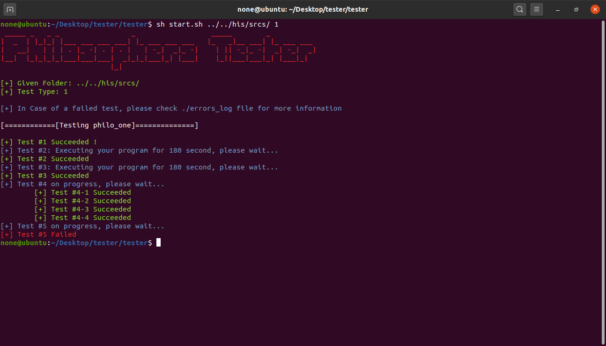

# Philosophers Project Tester 2021

this repo is a fork of [Philosphers-42Project-Tester](https://github.com/jgiron42/Philosphers-42Project-Tester.git) made by [newlinuxbot](https://github.com/newlinuxbot) adapted to the new subject (2021)


A script to test your Philosopher Project programs, philo and philo_bonus.

it only tests your programs by giving them specific arguments, and it doesn't check protection against scrambled output etc... 

## Preview



## Usage

```bash
Usage: start.sh <Project Folder> <Test Type>
	Type all:       test philo and philo_bonus"
	Type mandatory: test philo only"
	Type bonus:     test philo_bonus only"
```
